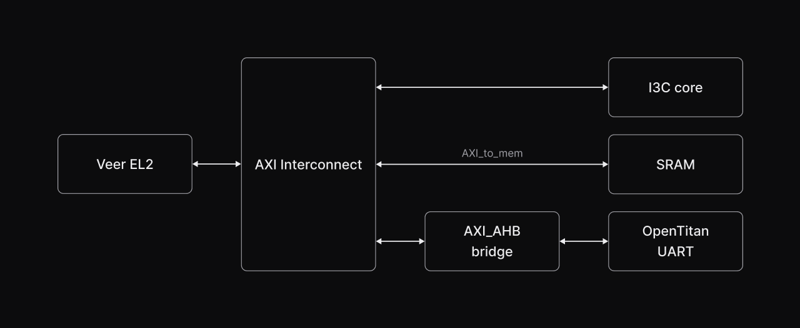

# Guineveer

Copyright (c) 2024-2025 [Antmicro](https://www.antmicro.com)

<picture>
  <source srcset="images/guineveer-logo-light.png" media="(prefers-color-scheme: light)"/>
  <source srcset="images/guineveer-logo-dark.png" media="(prefers-color-scheme: dark)"/>
  
</picture>

## Introduction

Guineveer is a configurable RISC-V VeeR EL2 SoC.
It provides a simple SoC design that can be modified and expanded with new peripherals.

### Architecture

The default system architecture of the SoC is shown in the diagram below:

### Default memory map

The table below summarizes the SoC's default memory address map:

|**Start Address** | **End Address** | **Size** | **Type** |
| --- | --- | --- | --- |
| 0x0000_0000 | 0x1FFF_FFFF | 512 MB | VeeR EL2 reserved space|
| 0x3000_0000 | 0x3000_1000 | 4 KB | Uart |
| 0x3000_1000 | 0x3000_2000 | 4 KB | I3c |
| 0x8000_0000 | 0x8FFF_FFFF | 256 MB | Mem |

## Requirements

System packages:

* `meson`
* `ninja-build`
* `gcc-riscv64-unknown-elf`
* `git`
* `curl`
* `make` in version 4.4 or newer
* `libbit-vector-perl`
* `verilator`

`python3` packages:

* `pyyaml`
* `topwrap`

Extra Python requirements to run Renode tests:

* `psutil`
* `robotframework==6.1`
* `robotframework-retryfailed`

## Usage

For detailed information about system architecture, testing and usage, refer to the documentation.

