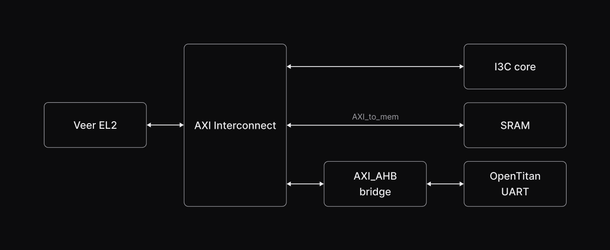

# System architecture

## Block diagram

The following diagram illustrates the key components and interconnections of the Guineveer SoC:

The Guineveer System-on-Chip (SoC) employs the VeeR EL2 core which is a 32-bit CPU which supports RISC-V’s integer (I), compressed instruction (C), multiplication and division (M), and instruction-fetch fence, CSR, and subset of bit manipulation instructions (Z) extensions.

The default configuration of the SoC features an AXI system bus which is used to communicate with a couple of peripherals including an SRAM memory module (accessed via an `AXI_to_mem` interface), an `I3C core`, and an `AXI-to-AHB bridge` providing access to an `OpenTitan UART` peripheral. 
The AXI Interconnect was generated using the [pulp generator](https://github.com/pulp-platform/axi/blob/master/scripts/axi_intercon_gen.py).

The SoC is split into two clock domains: one for the I3C core, and one for the rest of the SoC. On FPGA targets, the I3C core is clocked at 160MHz, while the rest of the SoC is clocked at 32MHz.

## Currently used peripherals and components

:::{list-table}
:name: tab-used-peripherials
:header-rows: 1
* - **Peripheral**
  - **Source**
* - VeeR EL2
  - <https://github.com/chipsalliance/Cores-VeeR-EL2>
* - AXI Interconnect
  - <https://github.com/pulp-platform/axi/blob/master/scripts/axi_intercon_gen.py>
* - AXI_AHB bridge
  - <https://github.com/antmicro/Cores-VeeR-EL2/blob/main/design/lib/axi4_to_ahb.sv>
* - AXI_to_mem
  - <https://github.com/pulp-platform/axi/blob/master/src/axi_to_mem.sv>
* - AXI_cdc
  - <https://github.com/pulp-platform/axi/blob/master/src/axi_cdc.sv>
* - UART OpenTitan
  - <https://github.com/lowRISC/opentitan/tree/master/hw/ip/uart>
* - I3C core
  - <https://github.com/chipsalliance/i3c-core>
:::

## Peripheral and component configuration

### VeeR EL2

The VeeR EL2 core is configured with FPGA optimizations enabled, and the branch predictor, ICCM, DCCM, and I-cache disabled.
Full set of configuration options used can be found in the [root Makefile](https://github.com/antmicro/guineveer/blob/main/Makefile).

### I3C

The I3C core uses mostly the default configuration, with one change: the input sync flip-flops are enabled, which is necessary for FPGAs to prevent glitches.

## Memory map

The table below summarizes Guineveer memory address map, including start, end and size for the various component types.
::: {csv-table}
    :file: memory_map.csv
    :header-rows: 1
